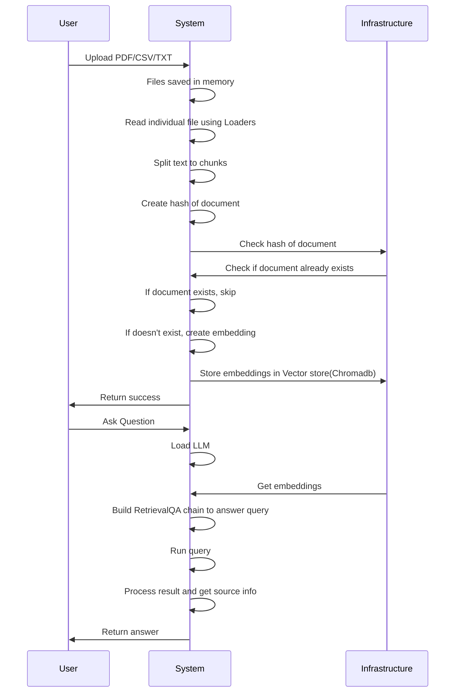

# Introduction
1. AQINA allows you to chat with uploaded PDF/CSV/TXT files using GPT functionalities.
2. The application intelligently breaks the document into smaller chunks and a semantic search is first performed on your file content and the most relevant answer is returned to the user.
3. Simple chat like UI

## Project Overview
- Approach
    There are three ways users can solve use cases with the help of LLMs on their custom data. Prompt engineering, embeddings, and fine-tuning. AQINA uses embeddings to answer queries.
    
    For making AQINA I’ve used the embeddings approach to retrieve information from documents using LLM. The documents are processed through a model that creates smaller chunks and generates embeddings of those chunks. These embeddings are stored in a vector database. When a user queries the LLM, the embeddings are retrieved from the vector store and used by the LLM to generate a response from the custom data.
    
    

- Tech Stack
    - Front-end: HTML, CSS, JavaScript
    - Back-end: Flask, Python
    - Database: ChromaDB to store vector embeddings
    - Framework: Langchain

## UML
