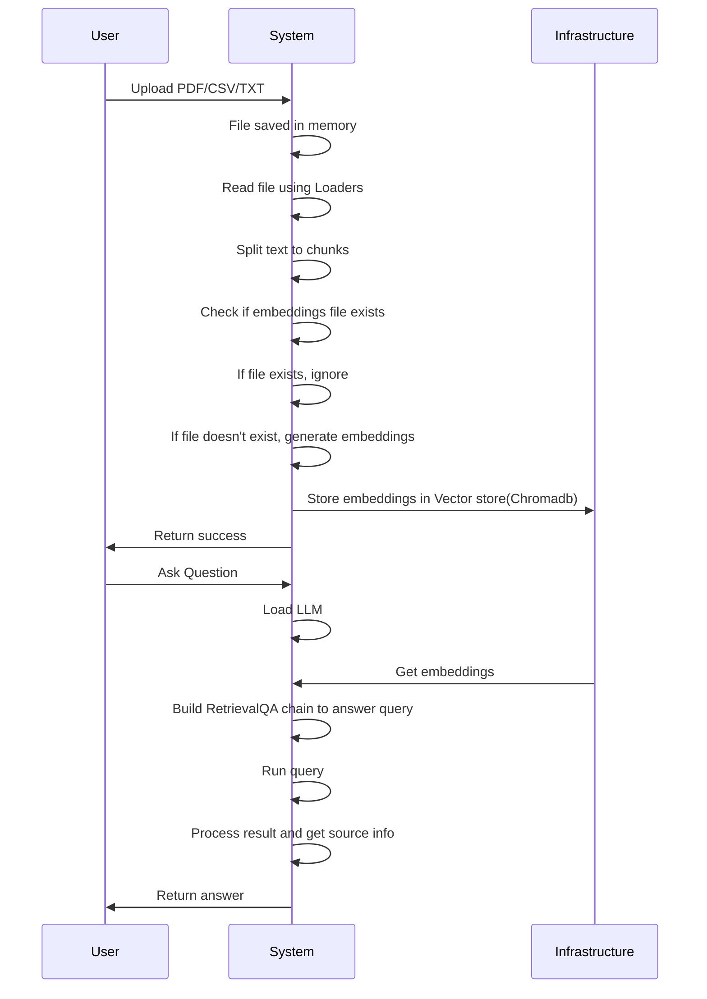

# aiqna
llm with custom vector embeddings

## UML

```mermaid
sequenceDiagram
    participant User
    participant System
    participant Infrastructure

    User->>System: Upload PDF/CSV/TXT

    System->>System: File saved in memory
    System->>System: Read file using Loaders
    System->>System: Split text to chunks
    System->>System: Check if embeddings file exists
    System->>System: If file exists, ignore
    System->>System: If file doesn't exist, generate embeddings
    System->>Infrastructure: Store embeddings in Vector store(Chromadb)
    System->>User: Return success

    User->>System: Ask Question
    System->>System: Load LLM
    Infrastructure->>System: Get embeddings
    System->>System: Build RetrievalQA chain to answer query
    System->>System: Run query
    System->>System: Process result and get source info
    System->>User: Return answer
```